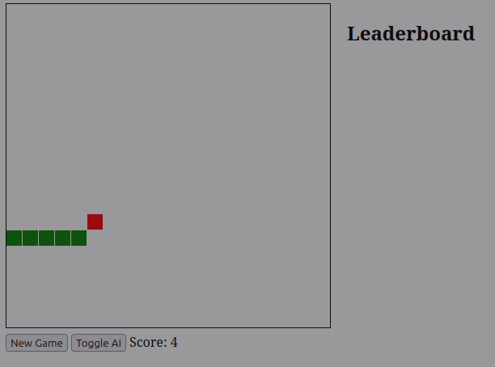

# Rust Snake Game

A web-based Snake game implementation in Rust with multiplayer support and AI mode. The game runs as a web server, allowing multiple players to play simultaneously through their web browsers while sharing a common leaderboard.



## Features

- Classic Snake gameplay with keyboard controls
- AI mode that automatically plays the game
- Shared leaderboard for tracking high scores
- Support for multiple simultaneous games
- Responsive canvas-based rendering
- Web-based interface accessible through any browser

## Technical Stack

- Backend: Rust with Actix-web framework
- Frontend: HTML5, JavaScript, Canvas API
- State Management: Thread-safe with Mutex
- Session Management: UUID-based game instances

## Prerequisites

- Rust and Cargo (latest stable version)
- Web browser with JavaScript enabled

## Installation

1. Clone the repository:
```bash
git clone https://github.com/mtmal/rust-snake-game.git
cd rust-snake-game
```

2. Build the project:
```bash
cargo build --release
```

## Running the Game

1. Start the server:
```bash
cargo run -- [PORT]
```
The PORT argument is optional and defaults to 8080.

2. Open your web browser and navigate to:
```
http://localhost:8080
```

3. To start multiple game instances, either:
   - Open multiple browser tabs pointing to the same address
   - Run multiple server instances on different ports

## How to Play

- Use arrow keys to control the snake's direction
- Collect red food squares to grow and increase your score
- Avoid hitting walls and the snake's own body
- Click "Toggle AI" to let the AI play the game
- When game ends, enter your name to save your score to the leaderboard

## AI Implementation

The AI uses a simple but effective pathfinding strategy:
- Evaluates all possible moves
- Calculates Euclidean distance to food
- Avoids collisions with walls and snake body
- Chooses the move that minimizes distance to food

## API Endpoints

- `GET /` - Serves the game interface
- `POST /new-game` - Creates a new game session
- `GET /game/{session_id}` - Gets current game state
- `POST /direction/{session_id}` - Updates snake direction
- `POST /update/{session_id}` - Updates game state
- `POST /ai-move/{session_id}` - Makes an AI move
- `GET /leaderboard` - Gets the current leaderboard
- `POST /submit-score` - Submits a new score

## Contributing

Contributions are welcome! Please feel free to submit a Pull Request.

## License

This project is licensed under the MIT License - see the [LICENSE](LICENSE) file for details.

## Author

Claude 3.5 Sonnet

## Acknowledgments

- Built with Rust and Actix-web
- Inspired by the classic Snake game

